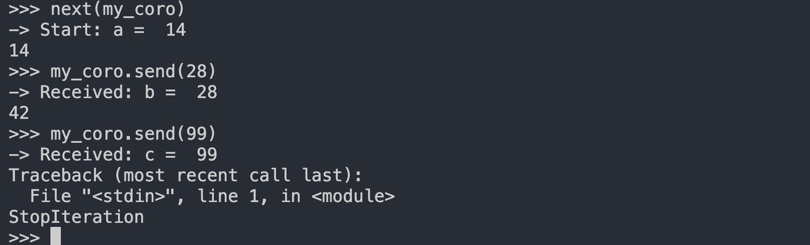
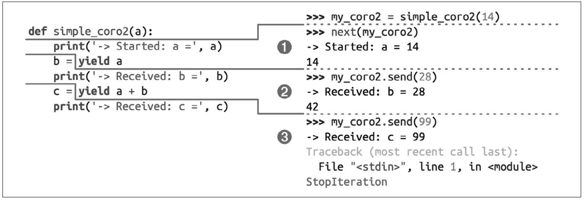

## 本章节介绍协程的概念及使用

 协程是轻量级的线程，可以理解为线程的轻量级实现，协程之间可以互相通信，并且可以互相调用。
 协程的实现原理是：协程的切换是通过栈来实现的，协程的切换是通过栈的切换来实现的，协程的切换是通过栈的切换来实现的。


```python
def simple_coro2(a):
    print('-> Start: a = ', a)
    b = yield a
    print('-> Received: b = ', b)
    c = yield a + b
    print('-> Received: c = ', c)
```




执行过程：




